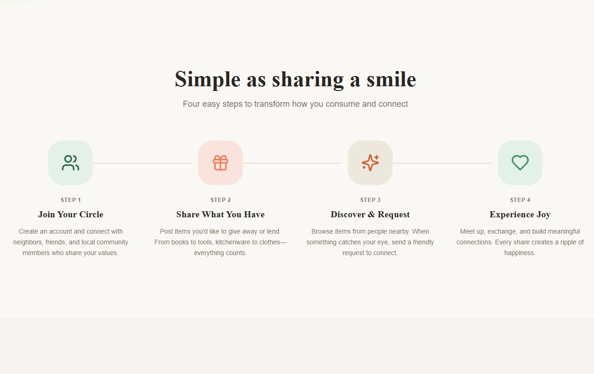
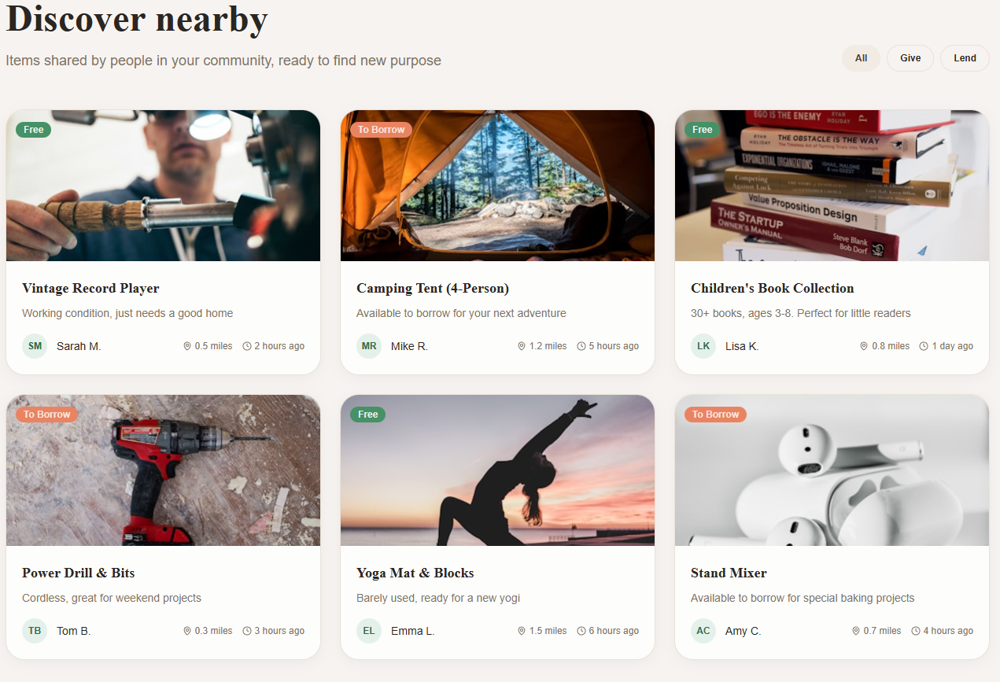
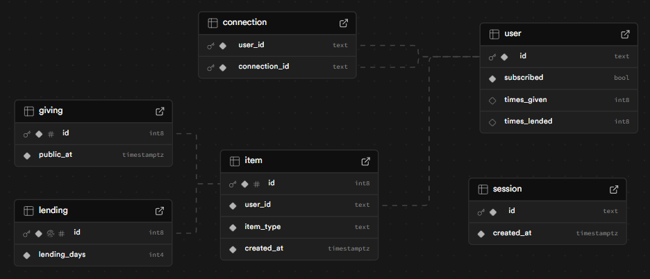

# Joy — Share. Connect. Delight.

Joy is a community-driven platform that makes giving and lending simple, safe, and delightful. People post things they want to give away or lend to friends, neighbors, and trusted connections — not into the anonymous void, but into the circle of people who matter.

**Why Joy?**
- Reduce waste and consumption by enabling local reuse.
- Save money
- Strengthen neighborhoods and personal networks through small acts of generosity.
- Offer a friendly, private alternative to public marketplaces.

**The problem** -- 
Many online marketplaces prioritize transactions over relationships. Items are listed to the world, interactions are anonymous, and trust-building is expensive. People who want to give or lend to neighbors often lack a simple, private, and joyful way to do so.
Sometimes you have something that you don't use but that means a lot, and don't want it to end up in the hands of strangers.

**Our solution** -- 
Joy focuses on the human experience: a warm, trust-first marketplace for your local circles.
- Post items to give or lend to your network.
- Discover items shared by people you already know or are connected to.
- Allows your well-loved items to end up in the hands of people you care about.
- Message, arrange hand-offs, and celebrate giving moments.

**Product highlights**
- Clean, modern UI and joyful brand language that encourages generosity.
- Privacy-first: sharing within trusted networks (connections) rather than the open web.
- Flexible item types: Giving and Lending workflows can coexist and expand later.
- Lightweight and extensible backend that can connect to Supabase/Postgres, S3, or serverless functions.

**Market & opportunity**
Local sharing economies are growing as consumers seek sustainable and community-first alternatives to traditional commerce. Joy addresses a unique niche: connection-driven exchanges (gifting, lending) rather than purely transactional resale.

**Business models (examples)**
- Sponsorships & partnerships with eco-friendly, high-quality companies for ads.
- Subscription will give access to free items without being a direct connection.

**Technology**
- Frontend: React + TypeScript + Vite — fast iteration and modern developer DX.
- Backend: modular DAOs with Postgres/Supabase and optional AWS S3 for media.
- Shared types and models in `joy-shared` for re-use across services and clients.

**Traction & next steps**
- Minimal prototype with user flows for posting, browsing, and connecting (in repo).
- Next milestones: onboarding flows, mobile-friendly UIs, and trust-building features (reviews, hand-off confirmations).

Get in touch
- Email: [vincentsreiley@gmail.com]

Database

--
_Thanks for building a kinder, more sustainable future. Joy is about the small exchanges that ripple outward._
